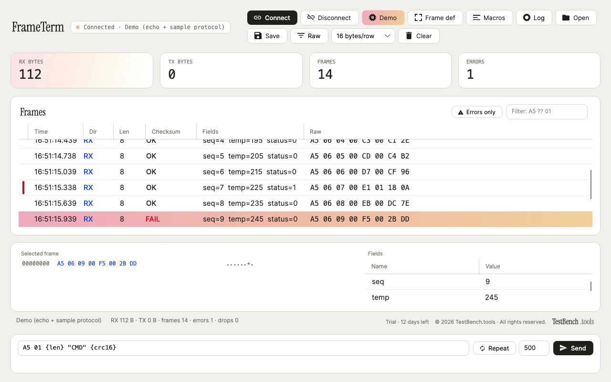

# FrameTerm

**A byte-oriented serial protocol workbench.** Define your frame once and every byte on the wire arrives as a parsed, checksum-verified, colour-coded record. No scripting required.



*Demo mode: the built-in sample protocol running through the pipeline — per-frame checksum OK/FAIL, live field parsing (seq/temp/status), and the hex dump and field table of the selected FAIL frame. Reproduce this screenshot with `dotnet test tests/Ft.App.Tests --filter CaptureDemoModeScreenshot`.*

## Download

Grab a build from the [releases page](https://github.com/Kim-Hakseong/testbench-frameterm/releases). Nothing to install — download and run. You can explore the whole feature set without hardware by clicking **Demo** in the toolbar.

| Platform | How to run |
|---|---|
| Windows x64 | Download and run `FrameTerm-*-win-x64.exe` (self-contained, no .NET needed) |
| macOS / Linux | Build from source — see below. Avalonia runs on both. |

The Windows build is not code-signed, so SmartScreen may warn on first run: choose **More info → Run anyway**.

## Why it exists

Terminal emulators like PuTTY and TeraTerm are built for text. Debugging a binary protocol needs framing, checksums, field decoding and byte-level visibility. FrameTerm does exactly that.

## Features

- **Declarative frame definition** — four framing modes: delimiter (start/end sequences with escaping), fixed length, length field (offset/size/endianness/adjustment) and silent gap. The result is identical no matter how the stream is chunked — feed it one byte at a time and you get the same frames, guaranteed by tests.
- **Checksum engine** — fully parameterised CRC (width 8/16/32, poly, init, refin/refout, xorout) plus XOR8 and SUM8. Presets for CRC-16/MODBUS, CRC-16/CCITT-FALSE, CRC-32 and CRC-8, every one verified against golden vectors from the public catalogue. Each frame is marked OK or FAIL.
- **Field parser** — declare offset, type and endianness (u8…s32, f32) and a field table renders live for every frame.
- **Highlight rules** — byte patterns with `??` wildcards, or field conditions (=, ≠, >, <), mapped to colours. First match wins.
- **Send composer** — mix hex and ASCII: `A5 01 {len} "CMD" {crc16}`. Length and checksum placeholders are computed at send time. Twenty macros on function keys, plus repeat sending.
- **Dual view** — hex + ASCII dump with an offset column, adjustable bytes per row, RX/TX colouring and millisecond timestamps.
- **Logging and filters** — raw traffic written to file (hex + timestamps), errors-only and pattern filters, and a 10k-frame ring buffer for display.
- **Project files** — save and restore a whole session (port, framing, checksum, fields, highlights, macros) as a single JSON `.ftproj`.
- **TCP support** — the same pipeline runs over a TCP client or server. Auto-respond rules (pattern → composed reply, with optional delay) emulate devices and automate handshakes.
- **Demo mode** — one click runs the built-in sample protocol through an echo transport, so you can try the whole experience without hardware.

## Build and run

Requires the [.NET 8 SDK](https://dotnet.microsoft.com/download/dotnet/8.0).

```bash
dotnet build FrameTerm.sln
dotnet test               # offline and deterministic
dotnet run --project src/Ft.App
```

### Packaging a release

```bash
dotnet publish src/Ft.App -c Release -r win-x64  --self-contained true -p:PublishSingleFile=true -p:IncludeNativeLibrariesForSelfExtract=true -p:EnableCompressionInSingleFile=true -o publish/win-x64
dotnet publish src/Ft.App -c Release -r osx-arm64 --self-contained true -p:PublishSingleFile=true -o publish/osx-arm64
```

## Architecture

```
src/Ft.Core   — the engine, with zero UI dependencies
  Checksum/   parameterised CRC, presets, batch verification
  Framing/    four framers, structurally chunking-invariant
  Parsing/    field parser, byte patterns, highlight rules
  Compose/    hex/ascii/placeholder payload composer
  Transport/  serial, TCP client/server, echo fake (Stream abstraction)
  Pipeline/   bounded-queue RX pipeline, batched UI events, auto-respond
  Logging/    non-blocking raw log writer
  Project/    .ftproj model and JSON serialisation
  Licensing/  RFC 8032 Ed25519, offline licence keys
src/Ft.App    — Avalonia 11 UI (Fluent, MVVM)
tests/        — xUnit: golden vectors, invariance sweeps, TCP loopback, headless UI smoke
```

One design rule mattered most: no blocking I/O on the UI thread. The receive path is a bounded queue with drop counting, so a 921600 bps flood degrades gracefully instead of freezing the window. Time-dependent logic uses an injected clock, which keeps every test deterministic — no sleeps.

---

© 2026 TestBench.tools · All rights reserved.
